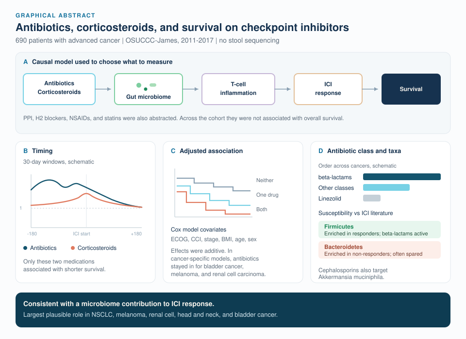

<h1>

co-med-io
 
 
 
</h1>

## The Effects of Concomitant Medications in Immunotherapy

This repository supports the manuscript, "Inferring the role of the microbiome on survival in patients treated with immune checkpoint inhibitors: causal modeling, timing, and classes of concomitant medications." The R Markdown files below reproduce the analyses and figures. A few YAML titles inside the files still use draft figure numbers; the filename is the manuscript figure.

The figure is a draft summary of the published analyses ([`graphical-abstract.svg`](graphical-abstract.svg)).

If you use this code, please cite the manuscript:

> Spakowicz D, Hoyd R, Muniak M, Husain M, Bassett JS, Wang L, Tinoco G, Patel SH, Burkart J, Miah A, Li M, Johns A, Grogan M, Carbone DP, Verschraegen CF, Kendra KL, Otterson GA, Li L, Presley CJ, Owen DH. Inferring the role of the microbiome on survival in patients treated with immune checkpoint inhibitors: causal modeling, timing, and classes of concomitant medications. BMC Cancer. 2020;20(1).

and this repository:

Patient-level data (`db.RDS`) are available on request. Please contact Dan Spakowicz at Daniel dot Spakowicz at osumc dot edu.

## Project summary

This project analyzes historical patient data from The Ohio State University Comprehensive Cancer Center – James. The goal is to relate medications known to affect the microbiome to overall survival among patients receiving immune checkpoint inhibitor therapy. Survival and clinical metadata were manually curated. Prescribed medications came from an information warehouse and were joined to that metadata.

The outcome in every Cox model is overall survival, `Surv(days, vitalstatus)`. Cancer strata used throughout are Bladder Cancer, Head and Neck Carcinoma, Melanoma, Non-Small Cell Lung Cancer, Renal Cell Carcinoma, Sarcoma, and Other.

## Figure and table scripts

Knit each file from the repository root unless noted. Most scripts read `db.RDS` from that directory. Two files look one directory up instead:

- [`Figure-2_allmeds-summary.Rmd`](Figure-2_allmeds-summary.Rmd) and [`Table-1-S1-S2_cohort-characteristics.Rmd`](Table-1-S1-S2_cohort-characteristics.Rmd) call `readRDS("../db-for-git.RDS")`.
- [`Figure-3_details-of-significant-groups.Rmd`](Figure-3_details-of-significant-groups.Rmd), [`Figure-4_combined-model.Rmd`](Figure-4_combined-model.Rmd), [`Figure-S_supplemental.Rmd`](Figure-S_supplemental.Rmd), and [`Table-S3_ns-of-meds-by-cancer.Rmd`](Table-S3_ns-of-meds-by-cancer.Rmd) call `readRDS("db.RDS")`.

| Manuscript piece | Script | What it produces |
| --- | --- | --- |
| Figure 1 and the labelled causal diagram | [`Figure-1_causal-model.Rmd`](Figure-1_causal-model.Rmd) | Directed acyclic graph of medications, the microbiome, inflammation, ICI response, and overall survival. No cohort file. |
| Figure 2 | [`Figure-2_allmeds-summary.Rmd`](Figure-2_allmeds-summary.Rmd) | Kaplan–Meier curves at ICI start; heatmap of hazard-ratio direction and p-value by cancer; unadjusted Cox tables for antibiotics and PPIs; exposed and unexposed counts. A knitted copy with those tables already rendered is [`Figure-2_allmeds-summary.html`](Figure-2_allmeds-summary.html). |
| Figure 3 | [`Figure-3_details-of-significant-groups.Rmd`](Figure-3_details-of-significant-groups.Rmd) | Hazard ratios for corticosteroids and antibiotics across sliding 30-day windows; class-by-cancer heatmaps. Writes `hazard-table.RDS`. |
| Figure 4 | [`Figure-4_combined-model.Rmd`](Figure-4_combined-model.Rmd) | Joint antibiotic-by-corticosteroid survival curves; adjusted Cox model for the full cohort; percentile-lasso hazard-ratio distributions by cancer. The lasso loop is `eval = FALSE` and takes about 20 minutes. |
| Figure 5 | [`Figure-5_lit-microbe.Rmd`](Figure-5_lit-microbe.Rmd) | Literature microbes on an Open Tree of Life subtree, with an antibiotic susceptibility heatmap ordered by `hazard-table.RDS`. |
| Supplemental medication composition | [`Figure-S_supplemental.Rmd`](Figure-S_supplemental.Rmd) | Counts and UpSet plots for the residual antibiotic and steroid groups, and for co-prescription within classes. Headings inside this file (Table S1, Table S2, Figures S1–S4) are local to the script. |
| Table 1 and exposure-stratified tables | [`Table-1-S1-S2_cohort-characteristics.Rmd`](Table-1-S1-S2_cohort-characteristics.Rmd) | Cohort characteristics overall, stratified by antibiotic exposure, and stratified by corticosteroid exposure. |
| Medication counts by cancer | [`Table-S3_ns-of-meds-by-cancer.Rmd`](Table-S3_ns-of-meds-by-cancer.Rmd) | Number of patients on each antibiotic class, corticosteroid generic, other medication, and immunotherapy agent, overall and by cancer. |

## Adding this cohort to a meta-analysis

Pool the hazard ratios, confidence intervals, and sample sizes printed by the scripts below. The same quantities for the unadjusted antibiotic and PPI models are already rendered in [`Figure-2_allmeds-summary.html`](Figure-2_allmeds-summary.html), so that file can be used before `db.RDS` is in hand. Re-knitting the R Markdown files requires the patient-level table.

### How exposure is coded

Antibiotics (`abx.28.28`) and corticosteroids (`steroid.28.28`) are 1 when any administration falls from 28 days before through 28 days after ICI start. PPIs (`ppi`), H2 blockers (`h2b_iostart`), NSAIDs (`nsaid_iostart`), and statins (`statin`) are indicators of a prescription at ICI start.

[`steroid-dbid-key.tsv`](steroid-dbid-key.tsv) maps each corticosteroid string to a DrugBank ID and a generic class (betamethasone, triamcinolone, prednisone, fludrocortisone, hydrocortisone, prednisolone, methylprednisolone, dexamethasone, prednisolone phosphate, cortisone). Antibiotic classes in the class-specific models are BetaLactam, Macrolide, Other.Antibacterial, Fluoroquinolone, Tetracycline, Vancomycin, Sulfamethoxazole, Clindamycin, and Metronidazole.

### Where the effect sizes and counts are

1. **Unadjusted antibiotic and PPI effects, with sample sizes.** In [`Figure-2_allmeds-summary.Rmd`](Figure-2_allmeds-summary.Rmd), the sections "Table of ABx hazard ratios", "Table of ABx sample sizes", and "PPI additional information" print, for all cancers combined and for each cancer, `estimate` (hazard ratio), `conf.low`, `conf.high`, and `p.value`, plus the number of patients with and without the exposure. The heatmap in the same file also covers H2 blockers, NSAIDs, statins, and corticosteroids (sign of the hazard ratio and log-rank p-value). The rendered tables are in [`Figure-2_allmeds-summary.html`](Figure-2_allmeds-summary.html).

2. **Adjusted antibiotic and corticosteroid effects.** In [`Figure-4_combined-model.Rmd`](Figure-4_combined-model.Rmd), section "Combined model for all cancers" fits `coxph(Surv(days, vitalstatus) ~ ABx + CS + ECOG + CCI + Stage IV + BMI + Sex + Age)` on the full cohort. `ggforest()` prints the adjusted hazard ratios and intervals. CCI is 0 when the comorbidity score is 0 or 1, and 1 otherwise. Stage IV is `staging == 4`. Cancer type is not a covariate in this model.

3. **Cohort size and baseline characteristics.** [`Table-1-S1-S2_cohort-characteristics.Rmd`](Table-1-S1-S2_cohort-characteristics.Rmd) builds Table 1 and the two tables stratified by `ABx within 28 days of ICI` and `CS within 28 days of ICI`. Use these for N, number exposed, and covariate balance (age, BMI, sex, ECOG, CCI, cancer, stage, immunotherapy agent).

4. **Counts by drug class and by cancer.** [`Table-S3_ns-of-meds-by-cancer.Rmd`](Table-S3_ns-of-meds-by-cancer.Rmd) tallies exposed patients for each antibiotic class, each corticosteroid generic, PPI / H2 blocker / NSAID / statin, and each immunotherapy agent. Pair those numerators with the denominators from Table 1 or Figure 2.

5. **Other exposure windows.** [`Figure-3_details-of-significant-groups.Rmd`](Figure-3_details-of-significant-groups.Rmd), section "Hazard Ratio over time", fits an unadjusted Cox model for every 30-day window whose left edge runs from day −180 to day +151 relative to ICI start. The plotted x-axis is the window midpoint (`leftanchor + 15`). The reference group is patients with no antibiotic, or no corticosteroid, anywhere in the ±180 day window. Hazard ratio, confidence limits, and p-value are in `abxwindresults` and `sterwindresults` before the plot. Per-cancer, class-specific hazard ratios are assembled as `hazardrats`.

6. **Class-level summary on disk.** Knitting Figure 3 writes `hazard-table.RDS`, which Figure 5 reads to order antibiotics. Each row is an antibacterial class with `Times.Worst`, `Times.Worst.3`, `Average.Rank`, and `Median.HR` (the median of the per-cancer hazard ratios, after missing cancer-specific ratios are filled with 1). For pooling, use the per-cancer hazard ratios and intervals from Figure 2 and Figure 3. `Median.HR` has no confidence interval and no sample size.

### Files in this repository

| File | Role in a meta-analysis |
| --- | --- |
| [`Figure-2_allmeds-summary.html`](Figure-2_allmeds-summary.html) | Rendered unadjusted hazard ratios, 95% confidence intervals, p-values, and sample sizes for antibiotics (±28 days) and PPIs, overall and by cancer. |
| [`steroid-dbid-key.tsv`](steroid-dbid-key.tsv) | DrugBank ID, drug string, and generic class used to code corticosteroid exposure. |
| [`fig5_ottid.csv`](fig5_ottid.csv) | Search string to Open Tree of Life unique name for the taxa drawn in Figure 5. This file is the phylogeny crosswalk, separate from the survival models. |

### Files the scripts expect

These are not committed. `db.RDS` (and the copy read as `../db-for-git.RDS`) is the patient-level analysis table and is available on request. The others are produced by knitting, or are auxiliary inputs for Figure 5 and the supplemental UpSet plots.

| File | Used by | Contents |
| --- | --- | --- |
| `db.RDS` | Figure 3, Figure 4, Figure S, Table S3 | Patient-level table: `days`, `vitalstatus`, `cancer.name`, medication day-lists, and covariates. |
| `../db-for-git.RDS` | Figure 2, Table 1 | Same table, read from the parent of this repository. |
| `hazard-table.RDS` | Written by Figure 3, read by Figure 5 | Antibiotic-class ranks and median hazard ratio across cancers. |
| `allmeds-for-upset.RDS` | Figure S | Generic-level medication indicators for the within-class UpSet plots. |
| `labelled_supertree_ottnames.tre` | Figure 5 | Phylogenetic tree (Open Tree of Life OTT IDs version 3.0, synthetic tree version 10.4). The live `rotl` calls in Figure 5 are commented out because those tree versions are no longer served. |
| `fig4_percentile-lasso.RDS`, `fig4-sup_percent-appearance-and-hr_boxplots.RDS` | Figure 4 | Optional caches for the percentile-lasso loop. The `saveRDS` / `readRDS` lines are commented out. |
